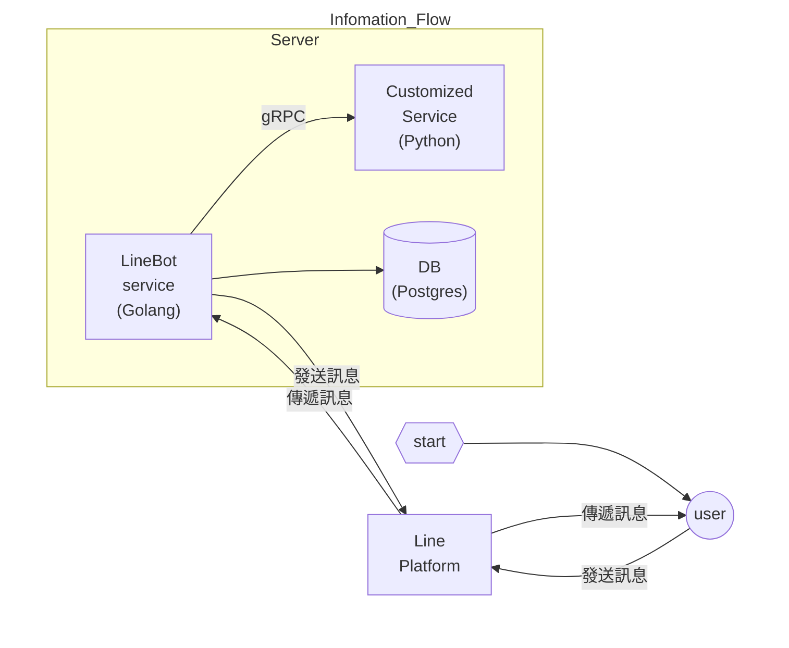

# LineBot

## Information Flow

## Flow Chart
(TO DO)

## 建立與佈署Line Bot
1. 在Line Developers建立Provider和Channel
https://developers.line.biz/en/
2. 完成基本設置，取得channel_token和channel_secret
參考：https://ithelp.ithome.com.tw/articles/10229943
3. 安裝server環境：`./install.sh`(未完成)  
4. 編譯程式碼：`./build.sh`  
5. 複製config.yaml.sample: `cp config.yaml.sample config.yaml`
6. [編輯config.yaml](#編輯config.yaml)
7. 啟動db: `docker-compose up -d`
8. 啟動service：`./linebot`
9. 使用ngrok將local的port forword出去(如果允許最好用更安全的方法)  
-- 安裝ngrok：https://ngrok.com/download  
-- 註冊登入後，取得token：https://dashboard.ngrok.com/get-started/your-authtoken  
-- 在local新增token：`ngrok config add-authtoken <AUTH_TOKEN>`  
-- 啟動ngrok client：`ngrok http <PORT>`  
-- 取得URL  
10. 回到Line Developers填入webhook URL
11. 完成

## 編輯config.yaml
### service
- port: LineBot service的http埠號  
- grpc: python grpc server的埠號  
- path: 用於存取資料的路徑  

### linebot
- channel_secret: 從line console取得的channel secret  
- channel_access_token: 從line console取得的channel access token  

### db
- host,port,user,password,database: db的連線資訊  

---

## gRPC
### python
- Install: `python3 -m pip install grpcio`
- install gRPC tools: `python3 -m pip install grpcio-tools`
- Generate gRPC code: `python3 -m grpc_tools.protoc -I ./ --python_out=./service --pyi_out=./service --grpc_python_out=./service service.proto`
- start server: `python3 server.py`

### golang
- `go install google.golang.org/protobuf/cmd/protoc-gen-go@v1.28`
- `go install google.golang.org/grpc/cmd/protoc-gen-go-grpc@v1.2`
- `export PATH="$PATH:$(go env GOPATH)/bin"`
- Generate gRPC code : `protoc --go_out=./service_client --go_opt=paths=source_relative --go-grpc_out=./service_client --go-grpc_opt=paths=source_relative service.proto`